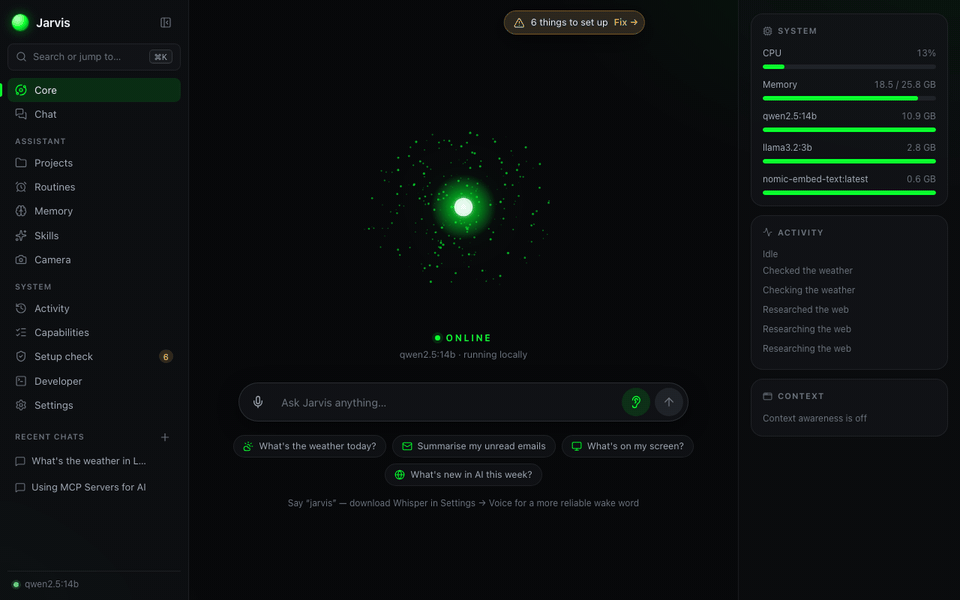
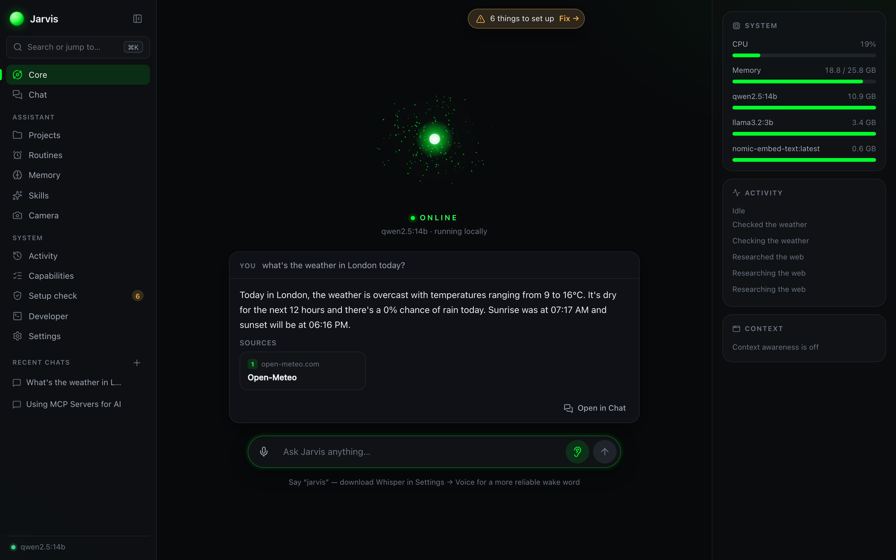
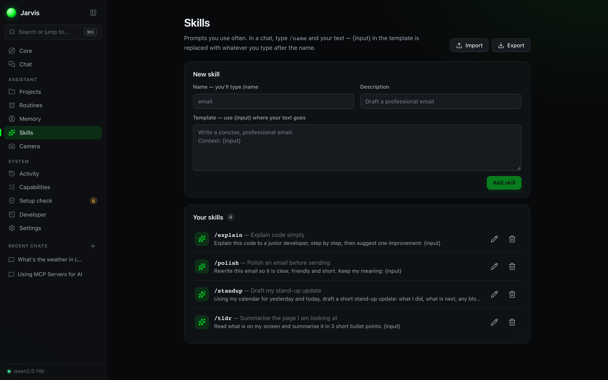
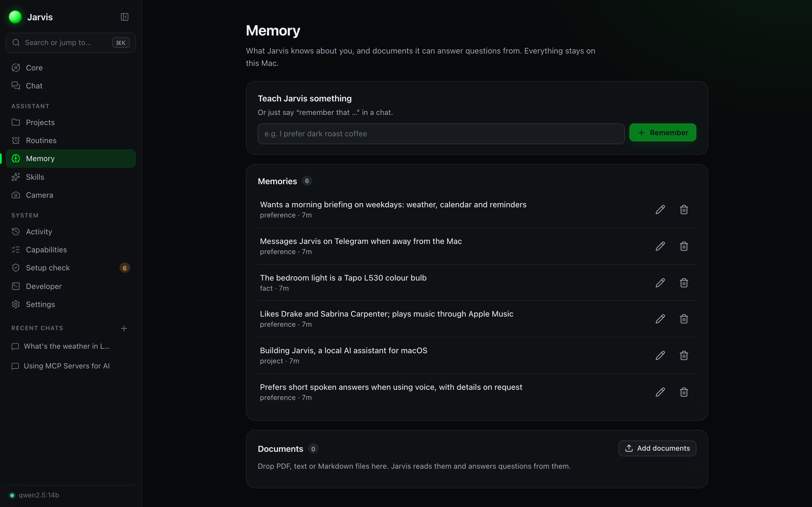
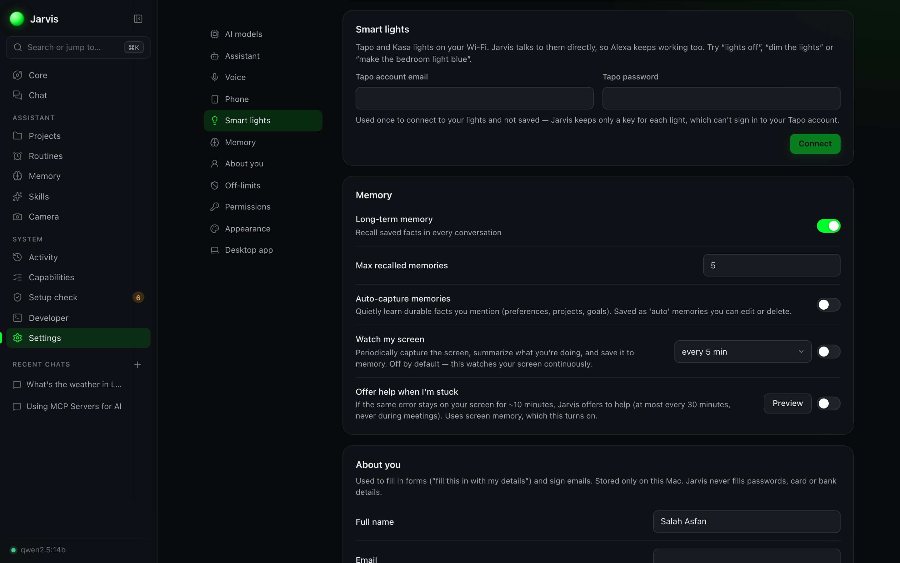
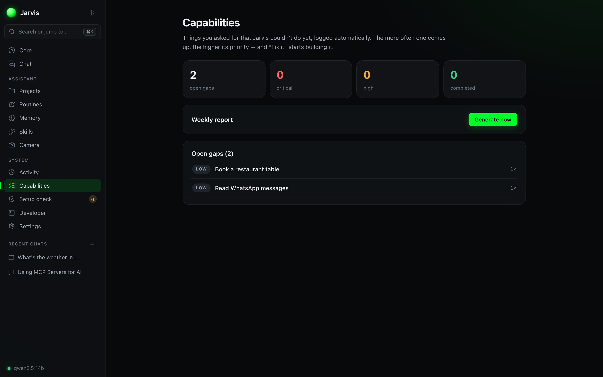

<div align="center">

# 🟢 Jarvis

### A private, local AI operating system for your Mac.

**Voice. Vision. Automation. Memory. 100% on your machine — no cloud, no API keys, no subscriptions.**

Jarvis turns your MacBook into the AI assistant from the movies: talk to it, let it see your screen and camera, control your apps, remember everything about you, and get real work done — all powered by local LLMs through [Ollama](https://ollama.com). Nothing ever leaves your Mac.

[](#-requirements)
[](#-requirements)
[](#️-tech-stack)
[](https://ollama.com)
[](#-why-jarvis)
[](LICENSE)

**⭐ If this looks cool, star the repo — it genuinely helps.**

[](https://buymeacoffee.com/salahasfan)

<br/>



</div>

---

## 🧠 Why Jarvis?

Every AI assistant wants your data in the cloud. Jarvis doesn't.

- **🔒 Totally private** — runs on local models via Ollama. No accounts, no API keys, no telemetry. Your conversations, screen, camera, files, and memories never leave your machine.
- **🎙️ Voice-first** — say *"Jarvis…"* and it wakes up (with a chime), listens with **offline Whisper**, and replies in a **human neural voice**. Have a real back-and-forth conversation, hands-free.
- **👁️ It can actually see** — reads your screen with Apple's OCR, watches through your camera, and answers questions about whatever's in front of you.
- **🦾 It does things** — opens apps, controls your browser, plays music, drafts emails, manages files, runs code — with a permission prompt before anything touches your system.
- **🧩 It's an OS, not a chatbot** — a living command-center dashboard with agents, projects, long-term memory, and a plugin system it can extend *itself*.
- **🆓 Free & source-available** — free for any **noncommercial** use. Fork it, hack it, make it yours.

---

## 📸 Screenshots

<div align="center">

**The Core** — a reactive command center, not a chat box


**Unified Workspace** — chat and code in one place, with runnable code blocks and live tool calls


</div>

| Custom Skills | Long-term Memory |
|:---:|:---:|
|  |  |

| Model & Voice Settings | Self-Improvement Registry |
|:---:|:---:|
|  |  |

---

## ✨ What it can do

<table>
<tr>
<td width="50%" valign="top">

### 🎙️ Voice
- Wake word (*"Jarvis…"*) with an audible chime — robust to room noise, no phantom wakes
- **Offline speech recognition** (Whisper `small.en`) — works in any browser
- Say *"stop"* any time to halt what it's doing
- **Human-sounding neural voices** (Kokoro TTS)
- Sentence-streaming replies (talks as it thinks)
- Conversation mode — reply without repeating the wake word

### 👁️ Vision
- Read the **exact text** on your screen (Apple Vision OCR)
- **Live camera** — *"open the camera and tell me what you see"*
- **You always know** — a glowing frame surrounds your screen whenever Jarvis reads or controls it
- **Screen watch** — "tell me when the download finishes"
- **Screen memory** — auto-journals what you're working on

### 🦾 Mac Automation
- **Full control of any app** — presses buttons (even icon-only ones) by name through macOS Accessibility, fills in fields, types, keyboard shortcuts, scrolls and drags · **Esc** is the emergency stop
- Open apps and **files by name** (*"open my CV"*), control windows, notifications, clipboard
- **Browser agent** — clicks links and buttons on any page, closes tabs by name, reuses your tabs
- Play **YouTube** & **Apple Music**, manage playlists
- **Calendar** — *"what's on my calendar tomorrow?"* (all calendars, repeating events included) · **Notes, Reminders** — read and create
- **Email** — *"summarize my emails"*, *"any new mail from Sam?"*, reply, draft, or send with attachments by name (*"email my CV to…"*); you approve every email first · draft iMessages
- **Knows your people** — *"email my landlord"* finds them in Jarvis's memory or your Contacts

</td>
<td width="50%" valign="top">

### 🧑‍💻 Developer Workspace
- Unified **Chat + Code** modes
- **Run code in a sandbox** — Python, JS/TS, C/C++, Go, Rust, Java
- Multi-file projects, package installs, **live HTML preview**
- Senior-engineer coding agent (review, refactor, tests, docs)

### 🧠 Memory & Knowledge
- **Long-term memory** — remembers your preferences & projects
- **Auto-capture** — learns facts as you talk (toggleable)
- **Document RAG** — drop in PDFs/Word/Excel, or index a whole folder, and search it by meaning
- **Documents** — read & compare PDFs/Word, create **Word, Excel and PowerPoint** files, fill in PDF forms, then email or send them
- **Projects** — per-project memory across conversations

### 🕵️ Research
- Live web search + page reading with **mandatory citations**
- Scoped search: GitHub, Stack Overflow, Reddit, arXiv, YouTube

### 🤖 Intelligence
- **Auto-routing agents** (research, coding, media, vision…)
- **Multi-step task planner** with a live checklist
- **Custom Skills** — save prompts, invoke with `/name`, import/export
- **Self-improving** — logs what it can't do and can write its own tools
- **Multi-model** — assign models per task, benchmark them
- **Fast by design** — only the tools a request needs go into the prompt, so even a 14B model answers quickly
- **Built-in eval suite** — 50+ real requests replayed against fake tools to check every model change
- **Instant commands** — *"open YouTube"*, *"open Safari"*, *"pause"* run in well under a second, no model needed

</td>
</tr>
</table>

### 🖥️ Menu-bar Quick Command
Hit **⌥Space** from *any* app to summon a floating command bar — ask about what's on your screen, get an answer, and get back to work without switching windows.

### ☀️ Daily Briefing
*"Jarvis, give me my daily briefing"* → live weather, today's calendar, and your reminders, narrated.

### 📱 Text Jarvis from your phone
Message Jarvis on **Telegram** from anywhere. It does the work on your Mac and replies in the chat:
- *"Send me the lease PDF from my Downloads"* → finds the file and sends it to you
- *"Research the best budget e-bikes and send me a Word doc"* → searches, writes a `.docx` with sources, sends it
- 🎙 **Voice notes** in, voice notes back · send it files or photos to ask about · approve risky actions with one tap

Two-minute setup — see [Phone setup](#-phone-setup-telegram).

---

## 🚀 Quick Start

```bash
# 1. Python 3.11+  —  macOS's built-in python3 is 3.9, which can't run Jarvis
brew install python@3.12          # skip if `python3 --version` already says 3.11+

# 2. Install Ollama and pull a model (https://ollama.com/download)
ollama pull qwen2.5:14b

# 3. Clone and run everything with one command
git clone https://github.com/Salahasfan02/Jarvis.git
cd Jarvis
chmod +x start.sh && ./start.sh
```

`start.sh` finds a Python 3.11+ on its own, installs everything on the first run (and again whenever a `git pull` changes the dependencies), and retries an install that was interrupted.

Your browser opens at **http://localhost:5173** and Jarvis is live. Press **Ctrl+C** (or `./stop.sh`) to turn it off. Nothing auto-starts; it only runs when you start it.

> 🔧 **Your model is picked for you.** If the configured model (`llama3.1` by default) isn't installed, Jarvis switches to one you have — `qwen2.5:14b` above. Change it anytime in **Settings → Model**.

> 🔐 **macOS will ask for permissions.** The first time Jarvis reads your screen, uses the camera, reads your calendar, or drives another app, macOS prompts for **Screen Recording**, **Camera**, **Microphone**, **Calendars**, **Automation** (Mail, Safari, Music) and **Accessibility**. Grant them in System Settings → Privacy & Security. Email features use the **Mail** app, so add your accounts (iCloud, Gmail, Outlook…) there.

<details>
<summary><b>Prefer the native desktop app?</b></summary>

The Electron shell is a **wrapper around the running stack**, not a standalone build — in dev it loads the Vite UI from `http://localhost:5173`, and it launches the backend using `backend/.venv`. So bring the stack up first:

```bash
./start.sh          # terminal 1 — leave this running

cd desktop          # terminal 2
npm install
npm start           # or: npm run package  → builds Jarvis.app
```

The desktop app adds a menu-bar icon, the **⌥Space** quick command, a **⌘⇧J** floating window, and "Open at Login."

Note that `npm run package` records the path to *this clone's* backend in `~/.jarvis/backend_path`. The resulting `Jarvis.app` still needs this repo on disk — a fully self-contained bundle is on the [roadmap](#️-roadmap).
</details>

<details>
<summary><b>Run each piece manually</b></summary>

```bash
# Terminal 1 — Ollama
ollama serve

# Terminal 2 — backend   (use an explicit 3.11+ interpreter, not bare `python3`)
cd backend && /opt/homebrew/bin/python3.12 -m venv .venv && .venv/bin/pip install -r requirements.txt
.venv/bin/python run.py            # → http://127.0.0.1:8765

# Terminal 3 — UI
cd frontend && npm install && npm run dev   # → http://localhost:5173
```

</details>

### Level up (optional, all local)

```bash
ollama pull nomic-embed-text   # semantic memory + smarter agent routing
ollama pull llava              # camera & screen vision
```

Then open **Settings** to enable them, download the offline **Whisper** and human **Kokoro** voice models, pick your theme, and set your wake word.

### 📱 Phone setup (Telegram)

1. In Telegram, message **[@BotFather](https://t.me/BotFather)**, send `/newbot`, pick a name, and copy the token it gives you.
2. In Jarvis, open **Settings → Phone (Telegram)**, paste the token, and press **Connect**.
3. Send the `/pair 123456` code shown there to your new bot from your phone — or press **Open in Telegram** if Telegram is on your Mac. That's it.

Things to know:
- **Nothing is exposed to the internet.** Jarvis polls Telegram with outbound requests only — no port forwarding, tunnel, or public URL. Your Mac must be awake with Jarvis running (on power, enable *Prevent automatic sleeping* in System Settings → Battery/Energy).
- **Only paired accounts get answers;** everyone else is ignored. Anything that needs permission (sending a file, reading your messages…) asks with **Allow / Deny** buttons, or reply *yes* / *no*. Dangerous tools (shell, AppleScript, deleting files) are **blocked from the phone** unless you switch them on.
- **Privacy trade-off:** Telegram bot chats aren't end-to-end encrypted, so what you send and receive passes through Telegram's servers. The feature is off until you set it up.
- Telegram bots can't take phone calls — voice notes are the hands-free way in (needs the Whisper model; voice replies need Kokoro). Files: up to 50 MB to your phone, 20 MB from it.
- Word documents are saved in `~/Documents/Jarvis`; files you send Jarvis land in `~/Downloads/Jarvis`. `/new` starts a fresh conversation, `/stop` cancels.

---

## 🔧 Troubleshooting

<details>
<summary><b>"backend/.venv uses Python 3.9" / <code>ResolutionImpossible</code> for onnxruntime</b></summary>

An environment from an older setup was built with macOS's Python 3.9. Install a newer Python, delete the `backend/.venv` folder, and start again — `start.sh` rebuilds it with 3.11+:

```bash
brew install python@3.12
rm -rf backend/.venv && ./start.sh
```
</details>

<details>
<summary><b>"Jarvis" doesn't react to the wake word</b></summary>

- In a browser, click anywhere on the Jarvis page once after it opens — browsers keep audio off until you do (the Core says *"Click anywhere so I can hear you"*). The desktop app doesn't need this.
- Download the **Whisper** model in **Settings → Voice** (offline, and far more reliable than the browser's recognizer).
- Grant **Microphone** access to your browser / Jarvis.app in System Settings → Privacy & Security.
</details>

<details>
<summary><b>First message fails with a model error</b></summary>

The active model doesn't exist locally. Run `ollama list` to see what you actually have, then pick one of those in **Settings → Model**. The out-of-the-box default is `llama3.1`.
</details>

<details>
<summary><b>The desktop app opens a blank window</b></summary>

In dev mode it loads `http://localhost:5173`, so the Vite dev server has to be running — start the stack with `./start.sh` before `npm start`.
</details>

<details>
<summary><b>Replies feel slow</b></summary>

Simple commands (*"open YouTube"*, *"pause"*) skip the model entirely. For everything else, the local model is the cost:
- **Settings → Task models → Utility:** pick a small model (e.g. `ollama pull qwen2.5:1.5b`). Titles and background work then stop competing with your conversation.
- **Settings → Keep model in memory:** `-1` keeps the model loaded, so replies never wait for it to load (uses RAM while Jarvis runs).
- **Developer → Audit** shows a timing line per message: how many tokens the model had to read and how long that took. After the first message in a conversation, that number should drop to a few hundred — that's the prompt cache working.
</details>

<details>
<summary><b>Ctrl+C didn't stop everything</b></summary>

`./start.sh` cleans up when you interrupt it from the terminal it's running in. If you launched it detached (`nohup`, `&`, or from another script), the backend and UI survive — use `./stop.sh`, which kills by port instead. Add `--all` to stop Ollama too.
</details>

<details>
<summary><b>Screen reading, camera, or app automation does nothing</b></summary>

Missing macOS permissions. Open System Settings → Privacy & Security and grant **Screen Recording**, **Camera**, **Microphone**, and **Accessibility** to your terminal (or to Jarvis.app if you packaged it), then restart Jarvis.
</details>

---

## 📋 Requirements

| | |
|---|---|
| **OS** | macOS on Apple Silicon (built & tested on an M-series Mac) |
| **[Ollama](https://ollama.com)** | with at least one model (e.g. `qwen2.5:14b`) |
| **Python** | **3.11+** — macOS's built-in `python3` is 3.9 and will not install the backend. `brew install python@3.12` |
| **Node.js** | 18+ |
| **RAM** | 16 GB minimum, 24 GB+ recommended for larger models |
| **Permissions** | Screen Recording, Camera, Microphone, Accessibility (prompted on first use) |

> 💡 **Model tip:** `qwen2.5:14b` is the sweet spot for tool-calling on a 16–24 GB Mac. The app is fully model-agnostic — switch models anytime in Settings, and even benchmark them on your hardware.

---

## 🔐 Security & Privacy

Jarvis is built to earn your trust:

- **Runs 100% locally** — the only network calls are the web-search tools *you* invoke, plus Telegram if you turn on the phone channel.
- **Permission system** — every action has a risk level. Safe actions run instantly; anything that touches your system (shell, AppleScript, deleting files) asks first, every time.
- **Audit log** — every tool call, confirmation, and denial is recorded.
- **Nothing is sent behind your back** — iMessages are only drafted; an email goes out only when you say *send* and approve that exact message (this approval can't be switched off).
- **Websites can't drive it** — the local API only accepts changes and chat connections from Jarvis's own UI, so a page you visit can't talk to Jarvis behind your back.
- **Sandboxed code** — generated code runs with no network, can't read your keys, mail or messages, can't script other apps, and can only write to its own folder.

---

## 🏗️ Tech Stack

**Backend:** FastAPI · Ollama · SQLite · faster-whisper (STT) · Kokoro (TTS) · Apple Vision (OCR) · pyobjc
**Frontend:** React · TypeScript · Vite · [Lucide](https://lucide.dev) icons (ISC)
**Desktop:** Electron (tray, global hotkeys, floating window)

Modular by design — new tools, agents, models, and integrations drop in without touching the core. See [`docs/architecture.md`](docs/architecture.md).

---

## 🗺️ Roadmap

- [ ] Encrypted memory & conversation storage
- [ ] First-run setup wizard (auto-pulls the right models)
- [ ] Self-contained `.app` (bundled backend)
- [ ] Meeting transcription with speaker separation
- [ ] Git integration in the coding workspace
- [ ] Community skill & plugin packs

---

## 🤝 Contributing

PRs, ideas, and bug reports are welcome. Jarvis is designed to be extended — writing a new tool or plugin is a few lines of Python (see [`docs/architecture.md`](docs/architecture.md)).

Run the backend tests (any OS, no Ollama needed): `cd backend && .venv/bin/pip install pytest && .venv/bin/python -m pytest`

Check how well a model handles real requests (needs Ollama; tools are faked, nothing on your Mac is touched): `cd backend && .venv/bin/python -m evals.run --model qwen2.5:14b` — prints pass/fail and timing for 50+ requests like *"email my CV to…"* and *"close the github tab"*.

## ⭐ Star it

If Jarvis is useful or just fun to poke at, **drop a star** — it helps other people find it and keeps the project going.

## ☕ Support

Jarvis is free and built in my spare time. If it saved you time or made you smile, you can [**buy me a coffee**](https://buymeacoffee.com/salahasfan) — it fuels the next late-night feature. Thank you! 🙏

<a href="https://buymeacoffee.com/salahasfan"></a>

## 📄 License

[PolyForm Noncommercial 1.0.0](LICENSE) — **free for any noncommercial use**: personal projects, hobby, research, education, and nonprofits. You can use, modify, and share it freely — just not sell it or use it commercially. Commercial use requires a separate license from the author.
